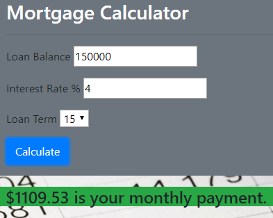

## REACT100 - Mortgage Calculator

In this project, I learned how to integrate Bootstrap into my project, how React hooks into the DOM, and how to use the mathematical order of operations in my JavaScript logic. I also realized the convenience of styling using class names via Bootstrap. Overall, this wasn't any different from my previous projects in vanilla JavaScript once I learned how the virtual DOM works.

### App Screenshot

